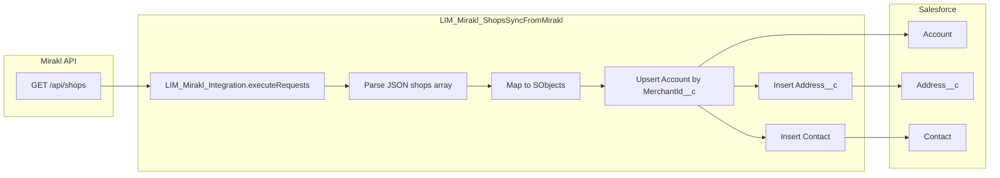

# Mirakl JSON → Salesforce Sync – Apex Class Plan

**Overview:** Apex class **`LIM_Mirakl_ShopsSyncFromMirakl`** parses the Mirakl GET /shops response and upserts Account, Address__c, and Contact records in Salesforce, using the existing LIM_Mirakl_Integration.

---

## Goal

Parse the Mirakl shops GET response and insert/update **Account**, **Address__c**, and **Contact** in Salesforce. Use the existing `LIM_Mirakl_Integration.cls` to perform the callout.

---

## Architecture (high-level)

There are **two views**: (1) **what the Invocable Apex does**—Mirakl callout, parse, and DML to Account / Address__c / Contact; (2) **how automation finishes**—the auto-launched Flow **`LIM_Mirakl_ShopsSyncFromMirakl`** runs that Apex, then maps outputs into **`Job__c`** (audit trail), same pattern as `LIM_Mirakl_ShopCreate`.

### Mirakl → Salesforce records (inside `LIM_Mirakl_ShopsSyncFromMirakl`)



### End-to-end: Flow + Invocable Apex + `Job__c` (after records are in Salesforce)

While the **Invocable** action runs, Apex performs the **Mirakl → Account / Address__c / Contact** sync (first diagram). When that action **completes**, it **returns** audit fields to the Flow (`success`, `statusCode`, `requestJson`, `responseJson`, `errorMessage`, …). The Flow then **does not** call Mirakl again: it **assigns** those values to `recJob` and **inserts** **`Job__c`**—the next steps in the same Flow definition.

**Flow architecture (auto-launched `LIM_Mirakl_ShopsSyncFromMirakl`):**


**What runs inside the Invocable step (`IA`):** same pipeline as the first diagram (**Mirakl → Salesforce records**): `LIM_Mirakl_Integration` GET (or optional `jsonBody`) → parse `shops[]` → upsert **Account**, then **Address__c**, **Contact**. **`Job__c`** is created **only after** `IA` returns, via **`setJob`** → **`Create_Job__c`**.

---

## 1. New Apex Class: `LIM_Mirakl_ShopsSyncFromMirakl`

**Location:** `force-app/main/default/classes/LIM_Mirakl_ShopsSyncFromMirakl.cls`

**Responsibilities:**

- **Option A – Callout + sync:** Call GET via LIM_Mirakl_Integration, parse the response, and upsert to Salesforce (scheduled or single run).
- **Option B – Parse + sync only:** Caller (Flow or another class) supplies the JSON; the class only parses, maps, and upserts.

To support both:

- **Public method 1:** `syncShopsFromMirakl()` – Performs GET(s) via `LIM_Mirakl_Integration` using Mirakl **pagination** (`max=100`, `offset` increasing by page size) until all shops are retrieved; merges `shops[]` and `total_count`, then calls `syncShopsFromJson(mergedJson)`. Optional `updated_since` is combined with `max`/`offset` on each page (`buildShopsQueryPath`). Audit `requestJson` describes pagination (`pagesFetched`, `mergedShopsCount`).
- **Public method 2:** `syncShopsFromJson(String jsonBody)` – Parses the supplied JSON and upserts Account/Address/Contact. Can also be called from Flow when the JSON is already available.

Make it Invocable so that "Mirakl shops sync" can be triggered from Flow.

---

## 2. JSON Parsing

Mirakl response structure:

```json
{ "shops": [ { "shop_id", "shop_name", "contact_informations": {...}, "default_billing_information": { "registration_address": {...}, "corporate_information": {...} }, "commission": {...}, "pro_details": {...}, ... } ], "total_count": N }
```

**Approach:** Use `JSON.deserializeUntyped(responseBody)` to get the root map, then the `shops` list; treat each element as `Map<String, Object>`. Nested objects (`contact_informations`, `default_billing_information`, `commission`, `pro_details`) will also be maps.

Typed wrapper classes are optional; all mapping can be done clearly with untyped maps. For better maintainability, you can add separate wrapper inner classes (e.g. `MiraklShop`, `MiraklContactInfo`, `MiraklAddress`).

---

## 3. Field Mapping (Mirakl → Salesforce)

### 3.1 Account (upsert by `MerchantId__c` External ID)

| Mirakl source                                                                                                         | Salesforce field                              | Notes                                                      |
| --------------------------------------------------------------------------------------------------------------------- | --------------------------------------------- | ---------------------------------------------------------- |
| `shop_id`                                                                                                             | `MerchantId__c`                               | String; External ID, unique – upsert key                   |
| `shop_name`                                                                                                           | `Shopname__c` + `Name`                        | Account.Name required                                      |
| `contact_informations.web_site`                                                                                       | `Website`                                     |                                                            |
| `contact_informations.country` / `shipping_country`                                                                   | `CommercialCountry__c`                        | Picklist; DEU → DE mapping may be needed (check value set) |
| `commission.grid_label` (e.g. "DE 15%")                                                                               | `Commission__c`                               | Percent field; parse the number and set (15 → 15.00)       |
| `default_billing_information.corporate_information.company_registration_number` / `pro_details.identification_number` | `CommercialRegisterNumber__c`                 |                                                            |
| `pro_details.VAT_number` / `tax_identification_number`                                                                | `VatIdCompany__c`                             |                                                            |
| (if in response)                                                                                                      | `LucidNumber__c`, `WeeeRegistrationNumber__c` | When present in Mirakl                                     |
| —                                                                                                                     | `AccountManager__c`                           | User lookup; leave null unless business rule               |
| —                                                                                                                     | `ReturnLabelProcess__c`, `Sla__c`             | Not in JSON; null or default                               |

`MerchantCompanyName__c` is a formula per the image, so do not set it.

### 3.2 Address__c (Headquarter)

- **Account__c:** Account Id from after the upsert.
- **AddressType__c:** `'Headquarter'` (fixed for this sync).
- **Compound address:**  
  Use `contact_informations` or `default_billing_information.registration_address`:
  - `street1` (+ optional `street2`) → `Address__Street__s`
  - `zip_code` → `Address__PostalCode__s`
  - `city` → `Address__City__s`
  - `country` / `country_iso_code` → `Address__CountryCode__s` (DEU → DE if Salesforce uses alpha-2).

Logic: Use `registration_address` first; if empty, use city/street/zip/country from `contact_informations`.

### 3.3 Contact

- **AccountId:** Same Account Id (after upsert).
- **FirstName, LastName, Email:** `contact_informations.firstname`, `lastname`, `email`.
- **Phone / MobilePhone:** `contact_informations.phone`, `phone_secondary` (map per your standard).
- **Title / Salutation:** `contact_informations.civility` (Mr/Mrs etc.) → Title or Salutation.
- **RoleMarketplace__c:** `'Mirakl Invitation'` (existing pattern in LIM_Mirakl_ShopCreate.cls line 188).

Strategy: One primary Contact per shop – if the Account already has a "Mirakl Invitation" contact, update it; otherwise insert a new one. Match by AccountId + RoleMarketplace__c = 'Mirakl Invitation' (and optionally Email).

---

## 4. Country Code

- **CommercialCountry__c** is a picklist; check the value set (DE vs DEU).
- **Address__CountryCode__s** is a compound address field; Salesforce often uses alpha-2 (DE).  
  If Salesforce uses alpha-2, you need Mirakl alpha-3 (DEU) → alpha-2 (DE) mapping. LIM_Mirakl_ShopCreate.cls has alpha-2 → alpha-3; define or reuse a reverse map (alpha-3 → alpha-2) for this class.

---

## 5. Execution Flow (per shop)

1. Parse root → `shops` list.
2. For each shop:
   - Build the Account record (MerchantId__c = `shop_id` as string); remaining fields from the mapping.
   - `Database.upsert(accounts, Account.MerchantId__c)`.
   - Using the upserted Account Id:
     - **Address__c:** Headquarter address from registration_address / contact_informations; insert (or match by "Headquarter" + AccountId and update – per business rule).
     - **Contact:** Create or update Mirakl Invitation contact (AccountId + RoleMarketplace__c).
3. Bulk-safe: Build full Account list, Address list, and Contact list; then run `upsert` / `insert` / `update` in batch (e.g. lists up to 200; respect DML limits).

---

## 6. Error Handling & Limits

- Callout: LIM_Mirakl_Integration already checks callout limits.
- JSON parse failure → try/catch, return or set a clear error message.
- DML: For partial success use `Database.upsert(..., false)`; return results and error list to inform the caller.
- Governor limits: If there are many shops, consider a batch/scheduled run (e.g. `LIM_Mirakl_ShopsSyncFromMiraklBatch`) later.

---

## 7. Mirakl API Path

The user-provided response structure has `shops` and `total_count`. The endpoint is typically a **GET** shops list (e.g. `/api/shops` or the documented path). Confirm the exact path from Mirakl docs; keep the path in a constant or Custom Setting in the class so it is easy to change.

---

## 8. Test Class

- **`LIM_Mirakl_ShopsSyncFromMirakl_Test.cls`:**
  - `syncShopsFromJson` with static JSON (the user's sample) – no callout.
  - Verify: Account upsert (MerchantId__c), Address__c (Headquarter), Contact (RoleMarketplace = Mirakl Invitation).
  - Negative: invalid JSON, empty shops, missing required fields.
  - Test the callout method with `Test.setMock(HttpCalloutMock, ...)` so the actual GET is not executed.

---

## 9. Optional / Future

- **Contract:** BillingFrequency__c and TermOfPayment__c were on Contract; there is no direct match in the Mirakl JSON. If needed later, add separate mapping and a Contract create/update step.
- **Closing times / Premium rules:** Separate objects/features; keep out of scope for this plan.
- **Batch/scheduled:** If the number of shops is large, run sync via `LIM_Mirakl_ShopsSyncFromMiraklBatch` (Batchable) and Scheduler.

---

## 10. Files to Add/Change

| Action    | File                                                                                                            |
| --------- | --------------------------------------------------------------------------------------------------------------- |
| Create    | `force-app/main/default/classes/LIM_Mirakl_ShopsSyncFromMirakl.cls` – sync logic, mapping, upsert, Invocable    |
| Create    | `force-app/main/default/classes/LIM_Mirakl_ShopsSyncFromMirakl.cls-meta.xml`                                    |
| Create    | `force-app/main/default/classes/LIM_Mirakl_ShopsSyncFromMirakl_Test.cls` – tests with static JSON + mock callout |
| Create    | `force-app/main/default/classes/LIM_Mirakl_ShopsSyncFromMirakl_Test.cls-meta.xml`                               |
| Create    | `force-app/main/default/flows/LIM_Mirakl_ShopsSyncFromMirakl.flow-meta.xml` – Apex → Job__c (see §11)            |
| No change | `LIM_Mirakl_Integration.cls` – use as-is for GET                                                                |

---

## Summary

- **`LIM_Mirakl_ShopsSyncFromMirakl`** parses the Mirakl shops JSON and creates/updates **Account** (upsert by MerchantId__c), **Address__c** (Headquarter), and **Contact** (Mirakl Invitation).
- **Flow `LIM_Mirakl_ShopsSyncFromMirakl`** calls the Invocable, then creates **`Job__c`** with request/response/status (see Architecture § End-to-end).
- Use **LIM_Mirakl_Integration** to perform the GET call and get the response, then run insert/update via `syncShopsFromJson` in the same class.
- Country and Commission mapping will need some logic (alpha-3→alpha-2, number from grid_label); the rest is direct field mapping.
- The test class should cover JSON-based sync and mock callout; batch/scheduler can be added later.

---

## 11. Invocable, Flow, and `Job__c`

How **`LIM_Mirakl_ShopsSyncFromMirakl`** is exposed to automation and how **`Job__c`** rows are created after sync (see also §1 and §10).

### 11.1 Invocable Apex

- **`@InvocableMethod(description='...')` only** — do not set `label` on the invocable method.
- **`@InvocableVariable`** — use **`description`** (and `required` where needed) only; **no `label`** on invocable variables.
- **Inputs (example):** optional `jsonBody` — if blank, perform GET `/api/shops` via `LIM_Mirakl_Integration`; if provided, skip callout and parse/sync from that JSON.
- **Outputs (for Flow / audit):** align with [`LIM_Mirakl_ShopCreate`](force-app/main/default/classes/LIM_Mirakl_ShopCreate.cls): e.g. `success`, `statusCode`, `errorMessage`, `requestJson` (minimal audit for GET or echo of input), `responseJson` (raw Mirakl body used for sync).

### 11.2 Flow `LIM_Mirakl_ShopsSyncFromMirakl`

- **Architecture diagram:** See **§ Architecture → End-to-end: Flow + Invocable Apex + `Job__c`** (linear Flow: `Start` → Invocable → `setJob` → `Create Job__c`).
- **Pattern:** Same as [`LIM_Mirakl_ShopCreate.flow-meta.xml`](force-app/main/default/flows/LIM_Mirakl_ShopCreate.flow-meta.xml): **Start → Apex action → Assignment (`setJob`) → Record Create (`insJob`)**.
- **No** `PartnerIntegration__c` update (unlike Shop Create).
- **Assignment** maps Apex outputs into a `Job__c` variable (`recJob`), then **Create** the `Job__c` record.
- **Suggested `Job__c` fields:** `ProcessingStatus__c` (e.g. SUCCESS/ERROR from status code), `ResultCode__c`, `ResultMessage__c`, `RequestJson__c`, `ResponseJson__c`, `ProcessingAction__c` = `DONE`, `ProcessingFinished__c` = `$Flow.CurrentDateTime`, **`JobType__c` = `PARTNER_INTEGRATION_ACCOUNT`** (reuse existing value), `JobAction__c` per org picklist (e.g. `INSERT`).

`Job__c` metadata may live only in the org; ensure Flow field API names match production.
