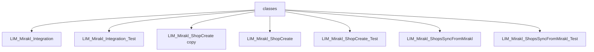

# Chapter: Apex Classes

## Overview

This chapter documents **7** component(s) from `force-app/main/default/classes/`. Salesforce metadata in this folder is summarized automatically; specialized relationship graphs are only extracted where parsers exist.

## Architecture Diagram

Inventory of components in this folder (each item is documented; links are not inferred between components unless stated in per-file docs):

## Component Index

| #   | Component Name                                                                  | Type | Trigger/Object | Status |
| --- | ------------------------------------------------------------------------------- | ---- | -------------- | ------ |
| 1   | [LIM_Mirakl_Integration](./LIM_Mirakl_Integration.md)                           | cls  | —              | —      |
| 2   | [LIM_Mirakl_Integration_Test](./LIM_Mirakl_Integration_Test.md)                 | cls  | —              | —      |
| 3   | [LIM_Mirakl_ShopCreate copy](./LIM_Mirakl_ShopCreate copy.md)                   | cls  | —              | —      |
| 4   | [LIM_Mirakl_ShopCreate](./LIM_Mirakl_ShopCreate.md)                             | cls  | —              | —      |
| 5   | [LIM_Mirakl_ShopCreate_Test](./LIM_Mirakl_ShopCreate_Test.md)                   | cls  | —              | —      |
| 6   | [LIM_Mirakl_ShopsSyncFromMirakl](./LIM_Mirakl_ShopsSyncFromMirakl.md)           | cls  | —              | —      |
| 7   | [LIM_Mirakl_ShopsSyncFromMirakl_Test](./LIM_Mirakl_ShopsSyncFromMirakl_Test.md) | cls  | —              | —      |

---
