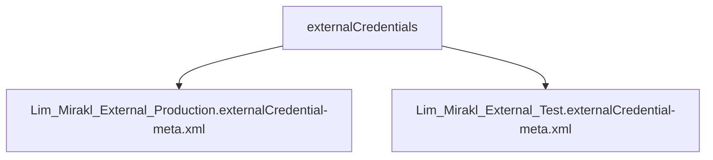

# Chapter: External Credentials

## Overview

This chapter documents **2** component(s) from `force-app/main/default/externalCredentials/`. Salesforce metadata in this folder is summarized automatically; specialized relationship graphs are only extracted where parsers exist.

## Architecture Diagram

Inventory of components in this folder (each item is documented; links are not inferred between components unless stated in per-file docs):

## Component Index

| #   | Component Name                                                                                                                | Type | Trigger/Object | Status |
| --- | ----------------------------------------------------------------------------------------------------------------------------- | ---- | -------------- | ------ |
| 1   | [Lim_Mirakl_External_Production.externalCredential-meta.xml](./Lim_Mirakl_External_Production.externalCredential-meta.xml.md) | xml  | —              | —      |
| 2   | [Lim_Mirakl_External_Test.externalCredential-meta.xml](./Lim_Mirakl_External_Test.externalCredential-meta.xml.md)             | xml  | —              | —      |

---
