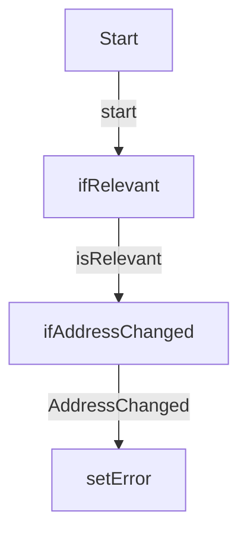

# LIM_Address_MiraklCheckChanges

**Type:** AutoLaunchedFlow | **Status:** Active | **API Version:** 64.0 | **Object/Trigger:** — / —

---

## Summary

The flow "LIM_Address_MiraklCheckChanges" is a AutoLaunchedFlow flow (status Active). It does not use a record-triggered start element in metadata, or runs as screen/autolaunched/scheduled per its configuration. checks for changes after initial mirakl transfer The automation includes 2 decision element(s) that branch execution based on configured conditions.

---

## Flow / Component Diagram

---

## Technical Details

### Variables

| Name            | Type    | Input | Output | Default |
| --------------- | ------- | ----- | ------ | ------- |
| recAddress      | SObject | True  | True   |         |
| recAddressPrior | SObject | True  | False  |         |
| varErrorMessage | String  | True  | True   |         |

### Decision Elements

#### ifAddressChanged

- **Default:** → `—` (AddressNotChanged)
- **Rule:** AddressChanged → `setError`
    - Condition logic: `or`
    - `recAddress.Address__City__s` NotEqualTo `elementReference:recAddressPrior.Address__City__s`
    - `recAddress.Address__Street__s` NotEqualTo `elementReference:recAddressPrior.Address__Street__s`
    - `recAddress.Address__PostalCode__s` NotEqualTo `elementReference:recAddressPrior.Address__PostalCode__s`
    - `recAddress.Address__CountryCode__s` NotEqualTo `elementReference:recAddressPrior.Address__CountryCode__s`

#### ifRelevant

- **Default:** → `—` (isNotRelevant)
- **Rule:** isRelevant → `ifAddressChanged`
    - Condition logic: `and`
    - `recAddress.Account__r.Backend__c` EqualTo `stringValue:Mirakl`
    - `recAddress.AddressType__c` EqualTo `stringValue:Headquarter`
    - `$Permission.MiraklIntegration` EqualTo `booleanValue:false`

### Record Operations

#### Lookups

| Name | Object | Fault path | Filter logic |
| ---- | ------ | ---------- | ------------ |
| —    | —      | —          | —            |

#### Creates

| Name | Object | Fault path | Filter logic |
| ---- | ------ | ---------- | ------------ |
| —    | —      | —          | —            |

#### Updates

| Name | Object | Fault path | Filter logic |
| ---- | ------ | ---------- | ------------ |
| —    | —      | —          | —            |

#### Deletes

| Name | Object | Fault path | Filter logic |
| ---- | ------ | ---------- | ------------ |
| —    | —      | —          | —            |

### Record field assignments (creates and updates)

—

### Actions

| Name | Action | Type | Fault |
| ---- | ------ | ---- | ----- |
| —    | —      | —    | —     |

### Subflows

| Name | Called flow | Fault |
| ---- | ----------- | ----- |
| —    | —           | —     |

### Fault paths

Elements referencing a fault connector are listed in the Record Operations and Actions tables above.

---

## Dependencies

- **Objects:** —
- **Subflows:** —
- **Apex / invocable actions:** —

---
