# LIM_IntegrationTest_CreateDataMirakl

**Type:** AutoLaunchedFlow | **Status:** Active | **API Version:** 64.0 | **Object/Trigger:** — / —

---

## Summary

The flow "LIM_IntegrationTest_CreateDataMirakl" is a AutoLaunchedFlow flow (status Active). It does not use a record-triggered start element in metadata, or runs as screen/autolaunched/scheduled per its configuration. It performs 0 record lookup(s), 4 create(s), 2 update(s), and 0 delete(s) as defined in the flow metadata.

---

## Flow / Component Diagram

```mermaid
graph TD
  E_Start["Start"]
  E_insAccount["insAccount"]
  E_insAddresses["insAddresses"]
  E_insContactAdmin["insContactAdmin"]
  E_insContract["insContract"]
  E_setAccount["setAccount"]
  E_setAccountUpdate["setAccountUpdate"]
  E_setAddress["setAddress"]
  E_setAddressHeadquarter["setAddressHeadquarter"]
  E_setAddressInvoice["setAddressInvoice"]
  E_setAddressReturn["setAddressReturn"]
  E_setContactAdmin["setContactAdmin"]
  E_setContract["setContract"]
  E_setUniqueName["setUniqueName"]
  E_updAccount["updAccount"]
  E_updContract["updContract"]
  E_Start -->|"start"| E_setUniqueName
  E_setAccount -->|"next"| E_insAccount
  E_setAccountUpdate -->|"next"| E_updAccount
  E_setAddress -->|"next"| E_setAddressInvoice
  E_setAddressHeadquarter -->|"next"| E_insAddresses
  E_setAddressInvoice -->|"next"| E_setAddressReturn
  E_setAddressReturn -->|"next"| E_setAddressHeadquarter
  E_setContactAdmin -->|"next"| E_insContactAdmin
  E_setContract -->|"next"| E_insContract
  E_setUniqueName -->|"next"| E_setAccount
  E_insAccount -->|"next"| E_setContactAdmin
  E_insAddresses -->|"next"| E_setContract
  E_insContactAdmin -->|"next"| E_setAccountUpdate
  E_insContract -->|"next"| E_updContract
  E_updAccount -->|"next"| E_setAddress
```

---

## Technical Details

### Variables

| Name            | Type    | Input | Output | Default |
| --------------- | ------- | ----- | ------ | ------- |
| colAddresses    | SObject | False | False  |         |
| recAccount      | SObject | False | False  |         |
| recAddress      | SObject | False | False  |         |
| recContactAdmin | SObject | False | False  |         |
| recContract     | SObject | False | False  |         |
| varTestNumber   | String  | True  | False  |         |
| varUniqueName   | String  | False | False  |         |

### Decision Elements

### Record Operations

#### Lookups

| Name | Object | Fault path | Filter logic |
| ---- | ------ | ---------- | ------------ |
| —    | —      | —          | —            |

#### Creates

| Name            | Object | Fault path | Filter logic |
| --------------- | ------ | ---------- | ------------ |
| insAccount      | —      | `—`        | —            |
| insAddresses    | —      | `—`        | —            |
| insContactAdmin | —      | `—`        | —            |
| insContract     | —      | `—`        | —            |

#### Updates

| Name        | Object   | Fault path | Filter logic |
| ----------- | -------- | ---------- | ------------ |
| updAccount  | —        | `—`        | —            |
| updContract | Contract | `—`        | and          |

#### Deletes

| Name | Object | Fault path | Filter logic |
| ---- | ------ | ---------- | ------------ |
| —    | —      | —          | —            |

### Record field assignments (creates and updates)

- **updContract** (update) on `Contract`:
    - `Status` ← stringValue:Activated

### Actions

| Name | Action | Type | Fault |
| ---- | ------ | ---- | ----- |
| —    | —      | —    | —     |

### Subflows

| Name | Called flow | Fault |
| ---- | ----------- | ----- |
| —    | —           | —     |

### Fault paths

Elements referencing a fault connector are listed in the Record Operations and Actions tables above.

---

## Dependencies

- **Objects:** Contract
- **Subflows:** —
- **Apex / invocable actions:** —

---
