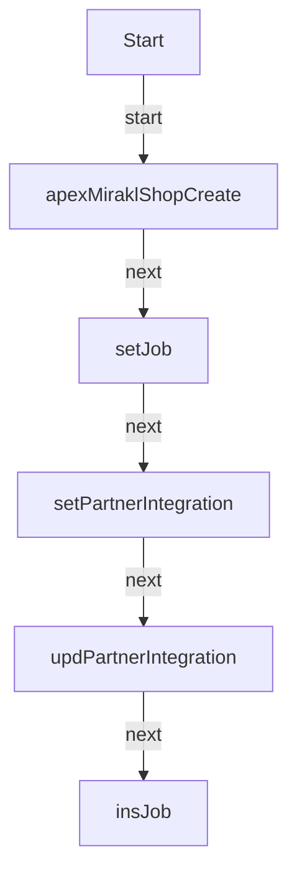

# LIM_Mirakl_ShopCreate

**Type:** AutoLaunchedFlow | **Status:** Draft | **API Version:** 63.0 | **Object/Trigger:** — / —

---

## Summary

The flow "LIM_Mirakl_ShopCreate" is a AutoLaunchedFlow flow (status Draft). It does not use a record-triggered start element in metadata, or runs as screen/autolaunched/scheduled per its configuration. It performs 0 record lookup(s), 1 create(s), 1 update(s), and 0 delete(s) as defined in the flow metadata. Actions invoked include: LIM_Mirakl_ShopCreate (apex).

---

## Flow / Component Diagram

---

## Technical Details

### Variables

| Name                    | Type    | Input | Output | Default |
| ----------------------- | ------- | ----- | ------ | ------- |
| recJob                  | SObject | False | False  |         |
| recPartnerIntegration   | SObject | False | False  |         |
| varMerchantId           | String  | False | False  |         |
| varPartnerIntegrationId | String  | True  | False  |         |
| varStatusCode           | String  | False | False  |         |

### Decision Elements

### Record Operations

#### Lookups

| Name | Object | Fault path | Filter logic |
| ---- | ------ | ---------- | ------------ |
| —    | —      | —          | —            |

#### Creates

| Name   | Object | Fault path | Filter logic |
| ------ | ------ | ---------- | ------------ |
| insJob | —      | `—`        | —            |

#### Updates

| Name                  | Object | Fault path | Filter logic |
| --------------------- | ------ | ---------- | ------------ |
| updPartnerIntegration | —      | `—`        | —            |

#### Deletes

| Name | Object | Fault path | Filter logic |
| ---- | ------ | ---------- | ------------ |
| —    | —      | —          | —            |

### Record field assignments (creates and updates)

—

### Actions

| Name                 | Action                | Type | Fault |
| -------------------- | --------------------- | ---- | ----- |
| apexMiraklShopCreate | LIM_Mirakl_ShopCreate | apex | `—`   |

### Subflows

| Name | Called flow | Fault |
| ---- | ----------- | ----- |
| —    | —           | —     |

### Fault paths

Elements referencing a fault connector are listed in the Record Operations and Actions tables above.

---

## Dependencies

- **Objects:** —
- **Subflows:** —
- **Apex / invocable actions:** LIM_Mirakl_ShopCreate

---
