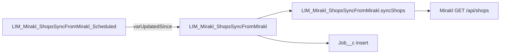

# LIM_Mirakl_ShopsSyncFromMirakl (and Scheduled wrapper)

**Components:** Apex `LIM_Mirakl_ShopsSyncFromMirakl` | Flows `LIM_Mirakl_ShopsSyncFromMirakl`, `LIM_Mirakl_ShopsSyncFromMirakl_Scheduled` | **API Version:** 66.0 (flows)

---

## 1. Purpose and scope

- **Direction:** One-way **Mirakl → Salesforce** for shop data exposed by Mirakl’s **`/api/shops`** response (or any JSON body with a root **`shops`** array in the same shape).
- **Accounts:** **Update-only.** Match by **`Account.MerchantId__c`** = Mirakl **`shop_id`** (stored as string). **No `Account` insert** in this class—new merchants in Mirakl without a Salesforce Account are **skipped**, not created.
- **Child records:** Only for merchants that **successfully matched** an existing Account in this run:
  - **`Address__c`** with **`AddressType__c`** = `Headquarter`
  - **`Contact`** with **`RoleMarketplace__c`** = `Mirakl Invitation`
- **HTTP:** When the Flow passes a blank `jsonBody`, the Apex class uses **`LIM_Mirakl_Integration`** to perform GET callouts (not represented in the Flow XML).

---

## 2. Architecture



### Scheduled flow (`LIM_Mirakl_ShopsSyncFromMirakl_Scheduled`)

1. **Get Records** `getLastMiraklShopSyncJob` on **`Job__c`**:
   - **`JobType__c`** = `PARTNER_INTEGRATION_ACCOUNT`
   - **`ProcessingStarted__c`** Is Null = **false**
   - Sort **`ProcessingStarted__c`** **Descending**, first record only
   - **`assignNullValuesIfNoRecordsFound`** = true
2. **Assignment** `assignVarUpdatedSince`: set Flow variable **`varUpdatedSince`** = `getLastMiraklShopSyncJob.ProcessingStarted__c`
3. **Subflow** `subShopsSyncFromMirakl` → **`LIM_Mirakl_ShopsSyncFromMirakl`**, passing **`varUpdatedSince`** into the child Flow input of the same name.

If **no** row qualifies, the lookup yields null → **`varUpdatedSince`** is null → the child Apex call runs with **`updatedSince`** null (full GET path without `updated_since` filter).

### Main flow (`LIM_Mirakl_ShopsSyncFromMirakl`)

1. **Start** → **Action** `apexMiraklShopsSync`: Invocable **`LIM_Mirakl_ShopsSyncFromMirakl`**, input **`updatedSince`** = **`varUpdatedSince`** (optional Flow input). `jsonBody` is not passed from this Flow (blank → GET path in Apex).
2. **Assignment** `setJob`: populate **`recJob`** (`Job__c`) from Apex outputs and formulas (see section 10).
3. **Create Records** `insJob`: insert **`recJob`**.

**Watermark timing:** **`ProcessingStarted__c`** and **`ProcessingFinished__c`** on the new Job are set to **`$Flow.CurrentDateTime`** in **`setJob`**, i.e. when the Flow runs **after** the Apex action completes—not the exact instant the HTTP call began. Operators should treat the stored **`ProcessingStarted__c`** on **`Job__c`** as the **audit timestamp of that flow interview’s job row**, used as the **next** incremental watermark when the scheduled flow runs again.

---

## 3. Apex entry modes (Invocable `syncShops`)

| `jsonBody` (Invocable input) | Behavior |
| ---------------------------- | -------- |
| **Blank** | **`syncShopsFromMirakl(updatedSince)`**: call Mirakl via **`LIM_Mirakl_Integration`**, GET with optional `updated_since`, paginate with `max` / `offset`, merge pages, then parse merged JSON. |
| **Non-blank** | **`syncShopsFromJson(jsonBody)`**: **no callout**; parse the supplied JSON as the Mirakl-style root object. |

Invocable also passes through **`updatedSince`** only when `jsonBody` is blank; it is ignored for the JSON-only path in the sense that no GET is built from it.

---

## 4. Mirakl HTTP behavior (`jsonBody` blank)

- **Path:** `/api/shops`
- **Query parameters:**
  - **`updated_since`**: present only if **`updatedSince`** is not null—value is UTC formatted `yyyy-MM-dd'T'HH:mm:ss'Z'` and **URL-encoded**.
  - **`max`**: page size, capped at **100** (Mirakl max; class uses `SHOPS_PAGE_SIZE_MAX`).
  - **`offset`**: index of first item; increased after each page by the number of shops returned on that page.
- **Paging loop:** Continues while there is a “full” page or **`total_count`** indicates more shops remain, subject to:
  - **Callouts:** stops if **`Limits.getCallouts()`** would exceed the limit; returns **`success = false`** with an error message.
  - **Safety caps:** `offset < 200000` and `pagesFetched < 1000` (loop guard).
- **Merge:** All pages’ **`shops`** arrays are concatenated; response **`total_count`** is preserved when present. **`requestJson`** on output is an **audit** JSON (HTTP method, pagination stats, `updatedSinceUtc`, note)—not the raw Mirakl URL alone.

---

## 5. Sample JSON and empty payload

### Minimal Mirakl-style shape

```json
{
  "total_count": 1,
  "shops": [
    {
      "shop_id": 12345,
      "shop_name": "Example Shop",
      "shipping_country": "DE",
      "contact_informations": {
        "firstname": "Jane",
        "lastname": "Doe",
        "email": "jane@example.com",
        "phone": "+49123456789",
        "phone_secondary": "+49987654321",
        "civility": "Mrs",
        "web_site": "https://example.com",
        "country": "DEU",
        "street1": "Musterstr. 1",
        "city": "Berlin",
        "zip_code": "10115"
      },
      "commission": { "grid_label": "15%" },
      "pro_details": {
        "identification_number": "ID-1",
        "VAT_number": "DE123456789",
        "tax_identification_number": "",
        "lucid_number": "LUCID-1",
        "weee_registration_number": "WEEE-1"
      },
      "default_billing_information": {
        "registration_address": {
          "street1": "Reg-Str. 2",
          "zip_code": "80331",
          "city": "München",
          "country_iso_code": "DE"
        },
        "corporate_information": {
          "company_registration_number": "HRB 12345"
        }
      }
    }
  ]
}
```

### Empty `shops` array

- **`success`** = **true**
- **`summaryMessage`** = `No shops in payload.`
- **`errorMessage`** = null (unless overridden by earlier failure)

The main Flow still creates a **`Job__c`** row with **SUCCESS** if Apex reports success.

---

## 6. Field mapping: Mirakl JSON → Salesforce

Merchant key: **`shop_id`** → string used as **`Account.MerchantId__c`** and for matching.

### Account (`buildAccountFromShop`)

| Mirakl path | Salesforce field | Notes |
| ----------- | ---------------- | ----- |
| `shop_id` | `MerchantId__c` | Required for processing row. |
| `shop_name` | `Name`, `Shopname__c` | If name blank, `Name` defaults to `Shop {shop_id}`. |
| `contact_informations.web_site` | `Website` | If `contact_informations` missing, not set here. |
| `contact_informations.country` **or** `shipping_country` | `CommercialCountry__c` | First non-blank; if no `contact_informations`, only `shipping_country`. Normalized via **`toCountryCode`** (section 7). |
| `commission.grid_label` | `Commission__c` | First number in label parsed as percent → stored as **fraction** (÷ 100). |
| `default_billing_information.corporate_information.company_registration_number` **or** `pro_details.identification_number` | `CommercialRegisterNumber__c` | First non-blank of the two. |
| `pro_details.VAT_number` **or** `pro_details.tax_identification_number` | `VatIdCompany__c` | First non-blank. |
| `pro_details.lucid_number` | `LucidNumber__c` | Set if non-blank. |
| `pro_details.weee_registration_number` | `WeeeRegistrationNumber__c` | Set if non-blank. |

### Address__c (`buildAddress`) — type **Headquarter**

| Mirakl path | Salesforce field | Notes |
| ----------- | ------------------ | ----- |
| — | `Account__c` | Parent Account Id. |
| — | `AddressType__c` | Constant `Headquarter`. |
| `default_billing_information.registration_address` **preferred** | street, zip, city, country | If that object lacks street/city/zip data, falls back to **`contact_informations`**. If neither has address data, **no** `Address__c` row is created for that shop. |
| `street1` or `street_1` (+ optional `street2` / `street_2`) | `Address__Street__s` | Second line appended with newline. |
| `zip_code` | `Address__PostalCode__s` | |
| `city` | `Address__City__s` | |
| `country_iso_code` **or** `country` | `Address__CountryCode__s` | Via **`toCountryCode`**. |

### Contact (`buildContact`)

| Mirakl path | Salesforce field | Notes |
| ----------- | ------------------ | ----- |
| — | `AccountId` | Parent Account Id. |
| — | `RoleMarketplace__c` | Constant `Mirakl Invitation`. |
| `contact_informations.firstname` | `FirstName` | |
| `contact_informations.lastname` | `LastName` | Defaults to **`Unknown`** if missing. |
| `contact_informations.email` | `Email` | |
| `contact_informations.phone` | `Phone` | |
| `contact_informations.phone_secondary` | `MobilePhone` | |
| `contact_informations.civility` | `Title` | |

If **`contact_informations`** is null, **`LastName`** = `Unknown` and other fields mostly unset.

---

## 7. Country codes (Apex-only)

- The class defines a static map **`COUNTRY_ALPHA2_TO_ALPHA3`** (ISO 3166-1 alpha-2 → alpha-3) for: **DE, AT, CH, FR, NL, BE, IT, ES, GB, UK, US, PL, SE, NO, DK, FI, CZ, IE, PT, LU** (UK maps to same alpha-3 as GB).
- **`ALPHA3_TO_ALPHA2`** is the reverse map for normalization.
- **`toCountryCode(String)`:** If 2 characters → returned uppercase as-is (Salesforce country code). If 3 characters and known → converted to alpha-2. Otherwise → **null**.
- **`LIM_Mapping_GetKey` / `LIM_Mapping_GetValue` Flows are not used** in this sync path.

---

## 8. No matching Account in Salesforce (`MerchantId__c`)

1. All distinct **`shop_id`** values from the payload are collected.
2. **Query:** `SELECT Id, MerchantId__c FROM Account WHERE MerchantId__c IN :merchantKeys`
3. Any **`shop_id`** **not** returned by this query goes into **`skippedNoAccount`**.
4. Those merchants are **not** updated; **no** `Address__c` or `Contact` is built for them.
5. **`summaryMessage`** (from **`buildSyncSummaryMessage`**) reports:
   - How many **Accounts updated successfully**, and  
   - How many **merchants were skipped** with **no Account**, listing their ids, e.g.  
     `Skipped N merchant(s) (no Account in Salesforce): id1, id2, ...`

**Semantics:**

- Skipping unknown merchants is **not** treated as a hard error by itself: **`errorMessage`** may still be null.
- If **no** Account was updated (**`merchantToAccountId`** empty) **and** there were **no** Account DML errors, **`success`** is **true** and **`errorMessage`** is null—the run is “successful” with an informative **`summaryMessage`** listing all skipped ids.
- If **no** Account updated **and** there **were** Account update errors, **`success`** is **false** and **`errorMessage`** lists those DML errors.

---

## 9. DML behavior

| Object | Operation | Notes |
| ------ | --------- | ----- |
| **Account** | `Database.update(..., false)` | Partial success; per-row failures appended to **`errorMessage`**. |
| **Address__c** | `Database.upsert(..., false)` | Existing HQ row for account looked up first; **Id** set when found. |
| **Contact** | `Database.upsert(..., false)` | Existing contact with **`RoleMarketplace__c`** = `Mirakl Invitation` looked up; **Id** set when found. |

Upsert errors are collected into the same **`errorMessage`** list with entity prefix.

---

## 10. Apex output → `Job__c` (main Flow `setJob` / `insJob`)

| Job__c field | Source |
| ------------ | ------ |
| `ProcessingStatus__c` | Formula **`fmlSuccessError`**: `SUCCESS` if Apex **`success`**, else `ERROR`. |
| `ResultCode__c` | Formula **`fmlResultCode`**: `TEXT(apexMiraklShopsSync.statusCode)`. |
| `ResultMessage__c` | Formula **`fmlResultMessage`**: If **`errorMessage`** blank → **`summaryMessage`** only; else **`errorMessage`** plus optional ` \| ` + **`summaryMessage`**. |
| `RequestJson__c` | `apexMiraklShopsSync.requestJson` |
| `ResponseJson__c` | `apexMiraklShopsSync.responseJson` |
| `ProcessingAction__c` | `DONE` |
| `ProcessingFinished__c` | `$Flow.CurrentDateTime` |
| `JobType__c` | `PARTNER_INTEGRATION_ACCOUNT` |
| `JobAction__c` | `INSERT` |
| `ProcessingStarted__c` | `$Flow.CurrentDateTime` |

Each run **inserts one new** **`Job__c`** row (audit log of that execution).

---

## 11. Operational notes

- **First run / no watermark:** If no **`Job__c`** exists with **`JobType__c`** = `PARTNER_INTEGRATION_ACCOUNT` and non-null **`ProcessingStarted__c`**, **`varUpdatedSince`** is null → GET runs **without** `updated_since` (full catalog per Mirakl paging behavior).
- **Next run:** Scheduled flow reads the **latest** such Job by **`ProcessingStarted__c`** descending and passes that datetime into the child flow as **`updatedSince`** for incremental GETs.
- **Scheduling:** The Flow metadata does not define a cron schedule. Use your org’s **Scheduled Flow** (or equivalent) to run **`LIM_Mirakl_ShopsSyncFromMirakl_Scheduled`** on the desired cadence. See comments in [`scripts/schedule_mirakl_shops_sync.apex`](../../scripts/schedule_mirakl_shops_sync.apex) for intended behavior (flow-only scheduling; no Schedulable Apex in that script).

---

## Related files

| File | Role |
| ---- | ---- |
| [`force-app/main/default/classes/LIM_Mirakl_ShopsSyncFromMirakl.cls`](../../force-app/main/default/classes/LIM_Mirakl_ShopsSyncFromMirakl.cls) | Invocable + mapping + DML |
| [`force-app/main/default/flows/LIM_Mirakl_ShopsSyncFromMirakl.flow-meta.xml`](../../force-app/main/default/flows/LIM_Mirakl_ShopsSyncFromMirakl.flow-meta.xml) | Apex + Job insert |
| [`force-app/main/default/flows/LIM_Mirakl_ShopsSyncFromMirakl_Scheduled.flow-meta.xml`](../../force-app/main/default/flows/LIM_Mirakl_ShopsSyncFromMirakl_Scheduled.flow-meta.xml) | Last Job lookup + subflow |
