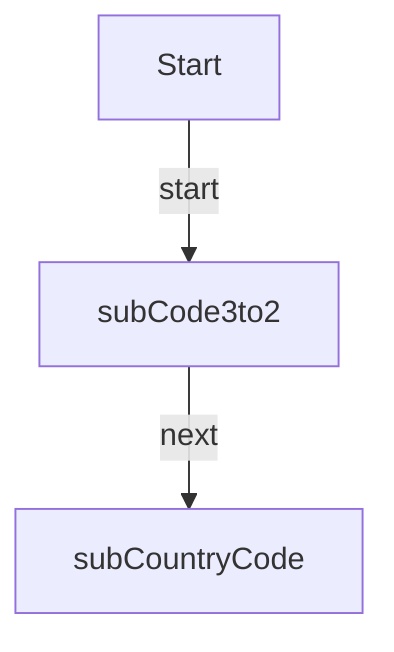

# LIM_Mirakl_TestMappings

**Type:** AutoLaunchedFlow | **Status:** Draft | **API Version:** 66.0 | **Object/Trigger:** — / —

---

## Summary

The flow "LIM_Mirakl_TestMappings" is a AutoLaunchedFlow flow (status Draft). It does not use a record-triggered start element in metadata, or runs as screen/autolaunched/scheduled per its configuration. It invokes the following subflow(s): LIM_Mapping_GetKey, LIM_Mapping_GetValue.

---

## Flow / Component Diagram

---

## Technical Details

### Variables

| Name | Type | Input | Output | Default |
| ---- | ---- | ----- | ------ | ------- |
| —    | —    | —     | —      | —       |

### Decision Elements

### Record Operations

#### Lookups

| Name | Object | Fault path | Filter logic |
| ---- | ------ | ---------- | ------------ |
| —    | —      | —          | —            |

#### Creates

| Name | Object | Fault path | Filter logic |
| ---- | ------ | ---------- | ------------ |
| —    | —      | —          | —            |

#### Updates

| Name | Object | Fault path | Filter logic |
| ---- | ------ | ---------- | ------------ |
| —    | —      | —          | —            |

#### Deletes

| Name | Object | Fault path | Filter logic |
| ---- | ------ | ---------- | ------------ |
| —    | —      | —          | —            |

### Record field assignments (creates and updates)

—

### Actions

| Name | Action | Type | Fault |
| ---- | ------ | ---- | ----- |
| —    | —      | —    | —     |

### Subflows

| Name           | Called flow          | Fault |
| -------------- | -------------------- | ----- |
| subCode3to2    | LIM_Mapping_GetKey   | `—`   |
| subCountryCode | LIM_Mapping_GetValue | `—`   |

### Fault paths

Elements referencing a fault connector are listed in the Record Operations and Actions tables above.

---

## Dependencies

- **Objects:** —
- **Subflows:** LIM_Mapping_GetKey, LIM_Mapping_GetValue
- **Apex / invocable actions:** —

---
