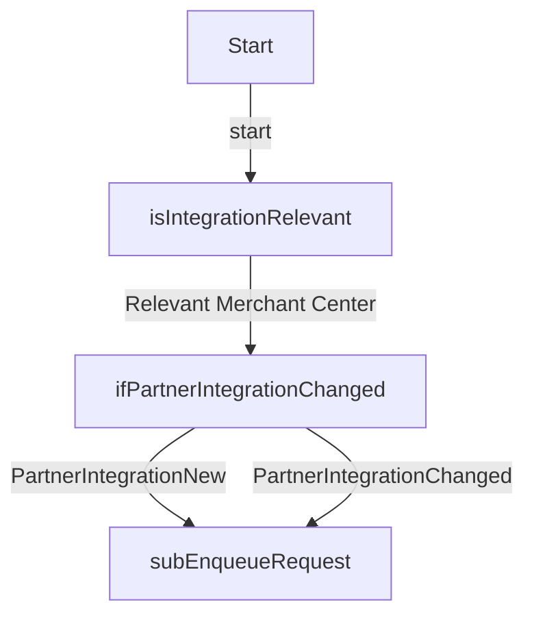

# LIM_PartnerIntegration_McCheckChangesMirakl

**Type:** AutoLaunchedFlow | **Status:** Active | **API Version:** 64.0 | **Object/Trigger:** — / —

---

## Summary

The flow "LIM_PartnerIntegration_McCheckChangesMirakl" is a AutoLaunchedFlow flow (status Active). It does not use a record-triggered start element in metadata, or runs as screen/autolaunched/scheduled per its configuration. checks if RECORD is relevant for Merchant Center integration and relevant FIELDS are changed. And calls LIM_Job_EnqueueRequest then It invokes the following subflow(s): LIM_MerchantCenter_EnqueueRequest. The automation includes 2 decision element(s) that branch execution based on configured conditions.

---

## Flow / Component Diagram

---

## Technical Details

### Variables

| Name                       | Type    | Input | Output | Default |
| -------------------------- | ------- | ----- | ------ | ------- |
| recPartnerIntegration      | SObject | True  | True   |         |
| recPartnerIntegrationPrior | SObject | True  | False  |         |
| varIsNew                   | Boolean | True  | False  |         |

### Decision Elements

#### ifPartnerIntegrationChanged

- **Default:** → `—` (PartnerIntegrationNotChanged)
- **Rule:** PartnerIntegrationNew → `subEnqueueRequest`
    - Condition logic: `and`
    - `recPartnerIntegration.MerchantId__c` IsNull `booleanValue:true`
    - `varIsNew` EqualTo `booleanValue:true`
- **Rule:** PartnerIntegrationChanged → `subEnqueueRequest`
    - Condition logic: `or`
    - `recPartnerIntegration.ConnectionType__c` NotEqualTo `elementReference:recPartnerIntegrationPrior.ConnectionType__c`
    - `recPartnerIntegration.OnboardingStatus__c` NotEqualTo `elementReference:recPartnerIntegrationPrior.OnboardingStatus__c`

#### isIntegrationRelevant

- **Default:** → `—` (NotRelevant)
- **Rule:** Relevant Merchant Center → `ifPartnerIntegrationChanged`
    - Condition logic: `1 AND ( 2 OR 3) AND 4`
    - `recPartnerIntegration.TypeOfIntegration__c` EqualTo `stringValue:NewIntegration`
    - `recPartnerIntegration.MerchantStatus__c` EqualTo `stringValue:integrating`
    - `recPartnerIntegration.MerchantStatus__c` EqualTo `stringValue:live`
    - `recPartnerIntegration.Backend__c` EqualTo `stringValue:Merchant Center`
- **Rule:** Relevant Mirakl → `—`
    - Condition logic: `(1 OR 2) AND 3`
    - `recPartnerIntegration.TypeOfIntegration__c` EqualTo `stringValue:NewIntegration`
    - `recPartnerIntegration.TypeOfIntegration__c` EqualTo `stringValue:InterfaceChange`
    - `recPartnerIntegration.Backend__c` EqualTo `stringValue:Mirakl`

### Record Operations

#### Lookups

| Name | Object | Fault path | Filter logic |
| ---- | ------ | ---------- | ------------ |
| —    | —      | —          | —            |

#### Creates

| Name | Object | Fault path | Filter logic |
| ---- | ------ | ---------- | ------------ |
| —    | —      | —          | —            |

#### Updates

| Name | Object | Fault path | Filter logic |
| ---- | ------ | ---------- | ------------ |
| —    | —      | —          | —            |

#### Deletes

| Name | Object | Fault path | Filter logic |
| ---- | ------ | ---------- | ------------ |
| —    | —      | —          | —            |

### Record field assignments (creates and updates)

—

### Actions

| Name | Action | Type | Fault |
| ---- | ------ | ---- | ----- |
| —    | —      | —    | —     |

### Subflows

| Name              | Called flow                       | Fault |
| ----------------- | --------------------------------- | ----- |
| subEnqueueRequest | LIM_MerchantCenter_EnqueueRequest | `—`   |

### Fault paths

Elements referencing a fault connector are listed in the Record Operations and Actions tables above.

---

## Dependencies

- **Objects:** —
- **Subflows:** LIM_MerchantCenter_EnqueueRequest
- **Apex / invocable actions:** —

---
