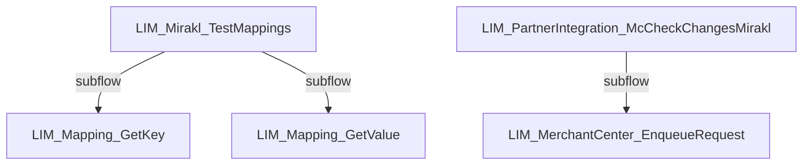

# Chapter: Flows

## Overview

This chapter documents **9** Salesforce Flow components. Flows automate business processes with declarative logic including record-triggered automation, screen flows, autolaunched flows, and subflow composition.

## Architecture Diagram

### Record-triggered flows and objects

### Subflow call graph

## Component Index

| #   | Component Name                                                                                  | Type             | Trigger/Object | Status |
| --- | ----------------------------------------------------------------------------------------------- | ---------------- | -------------- | ------ |
| 1   | [LIM_Account_MiraklCheckChanges](./LIM_Account_MiraklCheckChanges.md)                           | AutoLaunchedFlow | —              | Active |
| 2   | [LIM_Address_MiraklCheckChanges](./LIM_Address_MiraklCheckChanges.md)                           | AutoLaunchedFlow | —              | Active |
| 3   | [LIM_Contact_MiraklCheckChanges](./LIM_Contact_MiraklCheckChanges.md)                           | AutoLaunchedFlow | —              | Active |
| 4   | [LIM_Contract_MiraklCheckChanges](./LIM_Contract_MiraklCheckChanges.md)                         | AutoLaunchedFlow | —              | Active |
| 5   | [LIM_IntegrationTest_CreateDataMirakl](./LIM_IntegrationTest_CreateDataMirakl.md)               | AutoLaunchedFlow | —              | Active |
| 6   | [LIM_Mirakl_ShopCreate](./LIM_Mirakl_ShopCreate.md)                                             | AutoLaunchedFlow | —              | Draft  |
| 7   | [LIM_Mirakl_ShopsSyncFromMirakl](./LIM_Mirakl_ShopsSyncFromMirakl.md)                           | AutoLaunchedFlow | —              | Draft  |
| 8   | [LIM_Mirakl_TestMappings](./LIM_Mirakl_TestMappings.md)                                         | AutoLaunchedFlow | —              | Draft  |
| 9   | [LIM_PartnerIntegration_McCheckChangesMirakl](./LIM_PartnerIntegration_McCheckChangesMirakl.md) | AutoLaunchedFlow | —              | Active |

---
