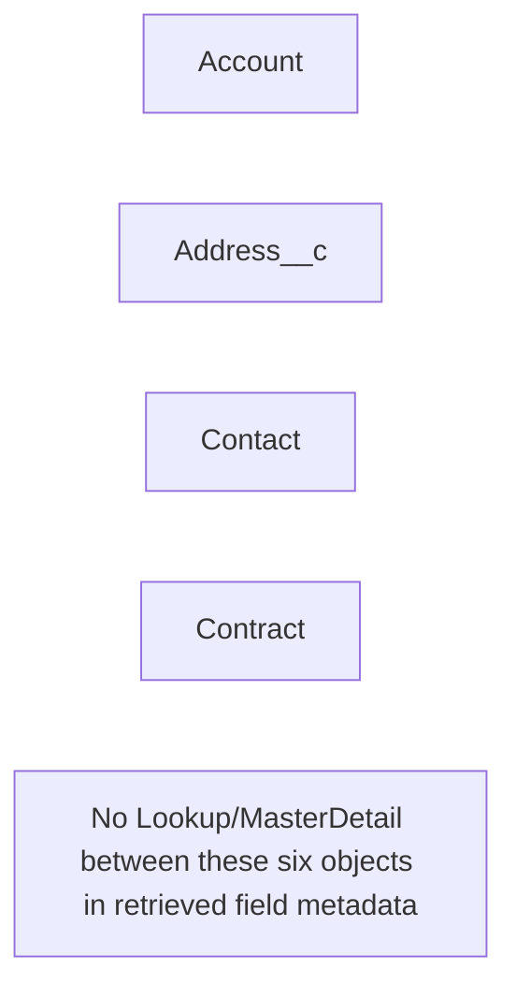

# Chapter: Objects

## Overview

This chapter documents **4** object metadata bundles (standard objects with retrieved custom fields, validation rules, and related configuration).

## Architecture Diagram

Relationships (Lookup / Master-Detail) **between the objects present in this project** are shown below. Cross-object references to types not included in this snapshot appear only in field tables and dependency sections.

## Component Index

| #   | Component Name                  | Type         | Trigger/Object | Status |
| --- | ------------------------------- | ------------ | -------------- | ------ |
| 1   | [Account](./Account.md)         | CustomObject | Account        | —      |
| 2   | [Address\_\_c](./Address__c.md) | CustomObject | Address\_\_c   | —      |
| 3   | [Contact](./Contact.md)         | CustomObject | Contact        | —      |
| 4   | [Contract](./Contract.md)       | CustomObject | Contract       | —      |

---
